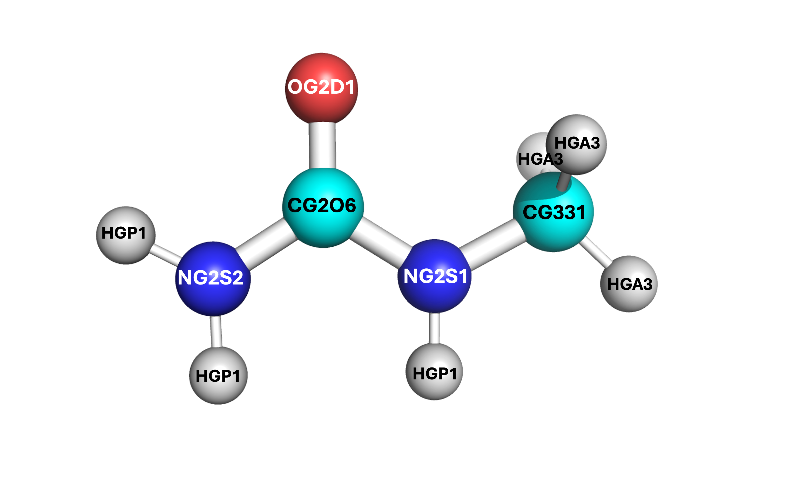
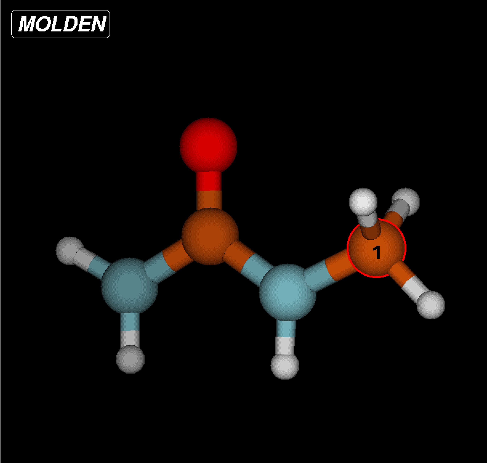
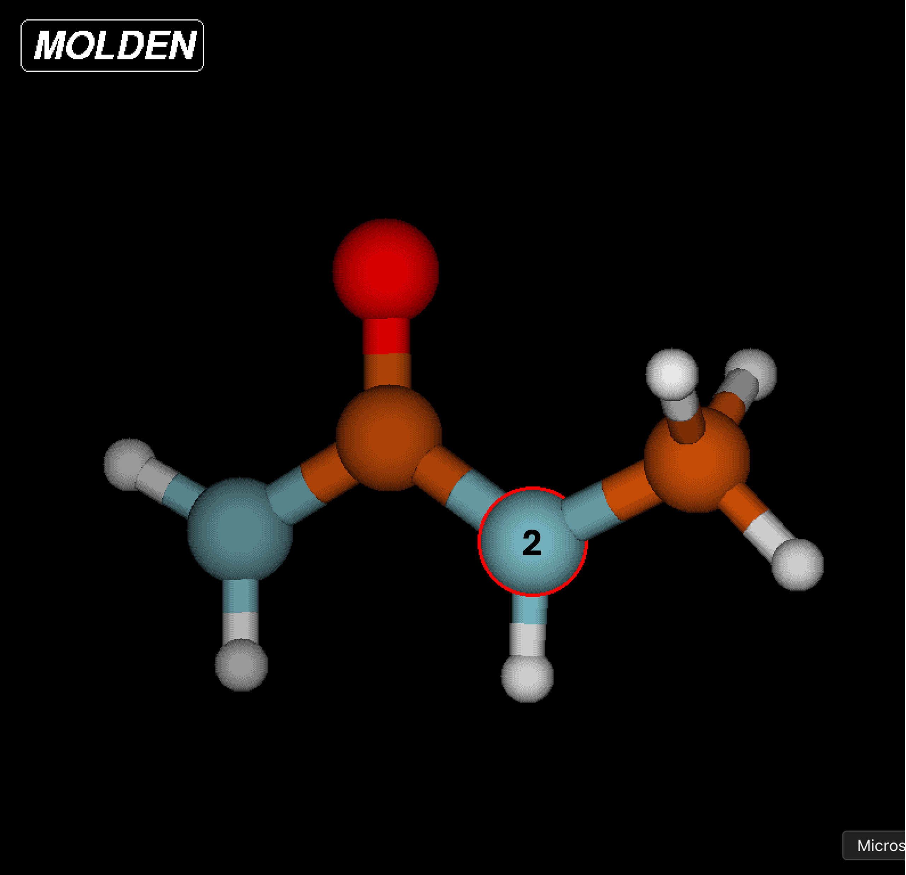
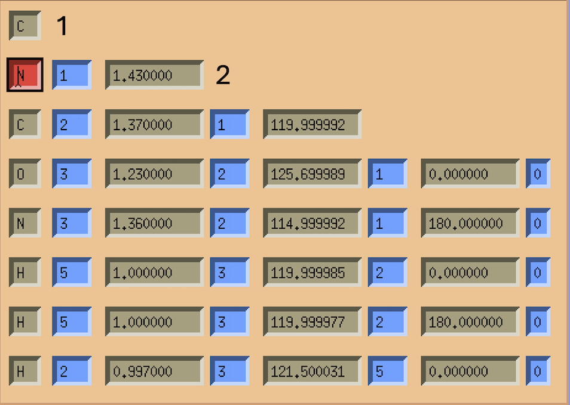
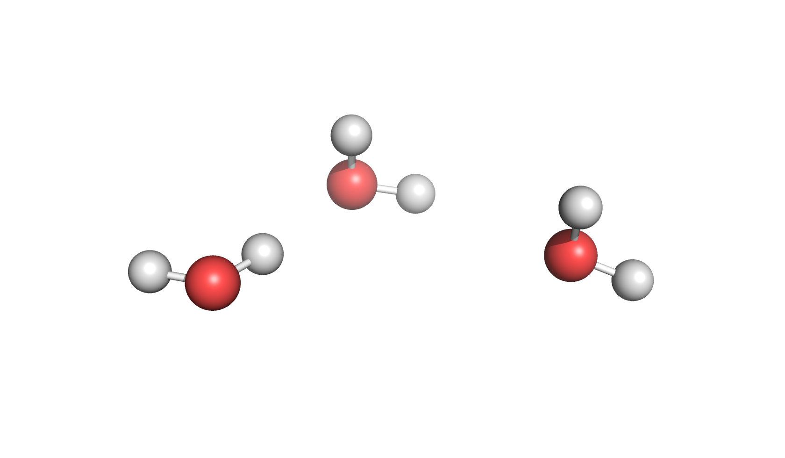

.. _Developing Molecules for LAMMPS:

|ico4| Developing Molecules for LAMMPS 
#############################################

.. |ico4| image:: lammps.png
   :height: 2.3ex
   :target: https://docs.lammps.org

In order to run simulations for new molecules in LAMMPS, :doc:`PACKMOL` and :doc:`MOLDEN` must be used. This step-by-step tutorial should (hopefully) equip you with enough information to successfully create and optimize a molecule for LAMMPS usage.

.. _Obtaining Force Field Data:

Obtaining Force Field Data
============================

If you have been provided a paper for a simulated molecule, most force field data *should* be in the Supplementary Information. However, this may not always be the case, or parts of the force field data may be missing. In this case, `CGenFF`_ is used. CGenFF is a force field website which optimizes the relevant data for a structure when provided a ``.mol2`` file. From this, an ``.str`` file is produced, which can be viewed for creating the Z-matrix. You will need to create an account within CGenFF in order to upload ``.mol2`` files.

.. _`CGenFF`: https://cgenff.com

To obtain ``.mol2`` files, many options are available. The easiest is to find a structure for the molecule which has a 3D structure download link. `PubChem`_ often has structures, or you can find others by simply using Google. There exist `converters`_ to change certain file types (such as ``.sdf`` or ``.xml``) to ``.mol2`` or even ``.xyz`` files.

.. _`PubChem`: https://pubchem.ncbi.nlm.nih.gov

.. _`converters`: https://www.cheminfo.org/Chemistry/Cheminformatics/FormatConverter/index.html

Once you have obtaiend the relevant files, login to CGenFF and select "Upload Molecule" from the screen. You can follow the steps as shown to make sure your molecule appears to be correct and submit the job. Then, you can download the ``.str`` file which contains all of its force field data from CHARMM.


|

.. note::
    It is **highly recommended** you convert the CGenFF output ``.str`` file to a ``.txt`` file and print it out on paper. You can do this by just copying all the data from vi and pasting it to a ``.txt`` format, or you can find a converter online.

Once the force field data is obtained, make sure to keep the ``.mol2`` file and the ``.str`` file handy as you :ref:`create the molecule <Creating the Molecule>` and optimize its structure.

.. _CGenFF Example:

CGenFF Example
---------------

The following CGenFF example is for 1-monomethylurea.::

    * Toppar stream file generated by
    * CHARMM General Force Field (CGenFF) program version 4.0
    * For use with CGenFF version 4.6
    *
    read rtf card append
    * Topologies generated by
    * CHARMM General Force Field (CGenFF) program version 4.0
    *
    36 1
    ! "penalty" is the highest penalty score of the associated parameters.
    ! Penalties lower than 10 indicate the analogy is fair; penalties between 10
    ! and 50 mean some basic validation is recommended; penalties higher than
    ! 50 indicate poor analogy and mandate extensive validation/optimization.
    RESI *****          0.000 ! param penalty=   0.000 ; charge penalty=   0.000
    GROUP            ! CHARGE   CH_PENALTY Z   EL   NB NBE RNG1 TYP RNG2 TYP RNG3 TYP
    ATOM C1     CG2O6   0.226 !    0.000   6   C    3  4  
    ATOM O      OG2D1  -0.487 !    0.000   8   O    1  2  
    ATOM N1     NG2S2  -0.521 !    0.000   7   N    3  3  
    ATOM N2     NG2S1  -0.342 !    0.000   7   N    3  3  
    ATOM C2     CG331  -0.011 !    0.000   6   C    4  4  
    ATOM H1     HGP1    0.296 !    0.000   1   H    1  1  
    ATOM H2     HGP1    0.296 !    0.000   1   H    1  1  
    ATOM H3     HGP1    0.273 !    0.000   1   H    1  1  
    ATOM H4     HGA3    0.090 !    0.000   1   H    1  1  
    ATOM H5     HGA3    0.090 !    0.000   1   H    1  1  
    ATOM H6     HGA3    0.090 !    0.000   1   H    1  1  
                ! TYP INR
    BOND C1   O    ! 2   0
    BOND C1   N1   ! 1   0
    BOND C1   N2   ! 1   0
    BOND N1   H1   ! 1   0
    BOND N1   H2   ! 1   0
    BOND N2   C2   ! 1   0
    BOND N2   H3   ! 1   0
    BOND C2   H4   ! 1   0
    BOND C2   H5   ! 1   0
    BOND C2   H6   ! 1   0
    IMPR C1     N2     N1     O     
    END
    read param card flex append
    * Parameters generated by analogy by
    * CHARMM General Force Field (CGenFF) program version 4.0
    *
    ! Penalties lower than 10 indicate the analogy is fair; penalties between 10
    ! and 50 mean some basic validation is recommended; penalties higher than
    ! 50 indicate poor analogy and mandate extensive validation/optimization.
    BONDS
    CG2O6  NG2S1   510.00     1.3700 ! DMCB & DECB, dimethyl & diehtyl carbamate, cacha & kevo
    CG2O6  NG2S2   430.00     1.3600 ! UREA, Urea. Uses a slack parameter from PROT from NG2S2  CT3, neutral glycine, adm jr. ==> re-optimize
    CG2O6  OG2D1   650.00     1.2300 ! UREA, Urea. Uses a slack parameter from PROT adm jr. 4/10/91, acetamide ==> re-optimize
    CG331  NG2S1   320.00     1.4300 ! PROT NMA Gas & Liquid Phase IR Spectra (LK)
    CG331  HGA3    322.00     1.1110 ! PROT alkane update, adm jr., 3/2/92
    NG2S1  HGP1    440.00     0.9970 ! PROT Alanine Dipeptide ab initio calc's (LK)
    NG2S2  HGP1    480.00     1.0000 ! PROT adm jr. 8/13/90 acetamide geometry and vibrations
    ANGLES
    NG2S1  CG2O6  NG2S2    70.00    115.00 ! from NG2S2 CG2O6 NG2S2, PENALTY= 1 CIR THIC       
    NG2S1  CG2O6  OG2D1    60.00    125.70 ! DMCB & DECB, dimethyl & diehtyl carbamate, cacha & kevo
    NG2S2  CG2O6  OG2D1    75.00    122.50   50.00   2.37000 ! UREA, Urea. Uses a slack parameter from PROT adm jr. 4/10/91, acetamide update ==> re-optimize
    NG2S1  CG331  HGA3     51.50    109.50 ! PROT NMA crystal (JCS)
    HGA3   CG331  HGA3     35.50    108.40    5.40   1.80200 ! PROT alkane update, adm jr., 3/2/92
    CG2O6  NG2S1  CG331    60.00    120.00 ! DMCB & DECB, dimethyl & diehtyl carbamate, cacha & kevo & xxwy
    CG2O6  NG2S1  HGP1     40.00    121.50 ! DMCB & DECB, dimethyl & diehtyl carbamate, cacha & kevo & xxwy
    CG331  NG2S1  HGP1     35.00    117.00 ! PROT NMA Vibrational Modes (LK)
    CG2O6  NG2S2  HGP1     50.00    120.00 ! PROT his, adm jr. 8/13/90  geometry and vibrations NOW UREA ==> re-optimize???
    HGP1   NG2S2  HGP1     23.00    120.00 ! PROT adm jr. 8/13/90  geometry and vibrations
    DIHEDRALS
    NG2S2  CG2O6  NG2S1  CG331      1.6000  1     0.00 ! from NG2S1 CG2O6 NG2S1 CG331, penalty= 1 THIC
    NG2S2  CG2O6  NG2S1  CG331      2.5000  2   180.00 ! from NG2S1 CG2O6 NG2S1 CG331, penalty= 1 THIC
    NG2S2  CG2O6  NG2S1  HGP1       4.0000  2   180.00 ! from NG2R51 CG2O6 NG2S1 HGP1, PENALTY= 10 CIR THIC
    OG2D1  CG2O6  NG2S1  CG331      4.0000  2   180.00 ! DMCB, dimethyl carbamate, cacha & xxwy
    OG2D1  CG2O6  NG2S1  CG331      0.9500  4     0.00 ! DMCB, dimethyl carbamate, cacha & xxwy
    OG2D1  CG2O6  NG2S1  HGP1       0.0000  2   180.00 ! DMCB & DECB, dimethyl & diehtyl carbamate, cacha & kevo
    NG2S1  CG2O6  NG2S2  HGP1       1.5000  2   180.00 ! from NG2S2 CG2O6 NG2S2 HGP1, PENALTY= 1 CIR THIC
    OG2D1  CG2O6  NG2S2  HGP1       1.4000  2   180.00 ! PROT adm jr. 4/10/91, acetamide update NOW UREA ==> re-optimize???
    HGA3   CG331  NG2S1  CG2O6      0.0000  3     0.00 ! DMCB, diethyl carbamate, kevo
    HGA3   CG331  NG2S1  HGP1       0.0000  3     0.00 ! PROT, sp2-methyl, no torsion potential
    IMPROPERS
    CG2O6  NG2S1  NG2S2  OG2D1     80.0000  0     0.00 ! from CG2O6 NG2S2 NG2S2 OG2D1, PENALTY= 1 CIR     
    END
    RETURN


Some things to note:

* There exist multiple types for nitrogen (``NG2S1`` & ``NG2S2``), carbon (``CG2O6`` & ``CG331``), and hydrogen (``HGP1`` & ``HGA3``). In order to determine which is which, the bonds and angles can provide key information. For example, the bond between ``NG2S1-CG331`` implies that the ``NG2S1`` nitrogen is bound to the methyl carbon. Additionally, the ``CG331-HGA3`` bond shows which hydrogens are for the methyl group. By process of elimination, this implies all ``HGP1`` hydrogens are bound to an amide group, the ``NG2S2`` nitrogen is an amide nitrogen only, and the ``CG2O6`` carbon is the central carbonyl. This process can be similarly seen via the angles. 
* All ``!`` denote comments, and all data afterward is from the CHARMM force field. You can ignore these comments. You can erase them so if you choose to print out the force field writeup they are not distracting when you enter the force field data into PACKMOL and the Z-matrix.

.. note::
    It is **vital** to label which force field atom is associated to which Z-matrix atom. **Atoms in the Z-matrix are not necessarily the same as atoms in the force field writeup.** If you confuse the labels and assign the atoms per only one of the two orders, **you will end up with an incorrect structure**. See the example below where "F" denotes the force field writeup label and "Z" denotes the Z-matrix label.

    .. image:: molden_images/compare.png
        :height: 250px
        :align: center




* Some of the angles contain other values, such as the ``NG2S2-CG2O6-OG2D1`` angle and the ``HGA3-CG331-HGA3`` angle. These are known as the Urey-Bradley terms, and **will be added later**. For any other parameters that are within your molecule's structure, **only** apply the valeus which can be put into the PACKMOL files (see :doc:`PACKMOL` for details).
* There exist two dihedral values for some of the same sets (``NG2S2-CG2O6-NG2S1-CG331`` and ``OG2D1-CG2O6-NG2S1-CG331``). These are to denote the cis and trans conformations. You can choose which is which according to the structure's current orientation, or by a stable orientation image found online. Only **one** of these dihedral conformations (cis **or** trans) should be entered.
* Each label within the FF document for an atom is equivalent to the atom's type. For example, 1-monomethylurea has the following structure (see right). Even though one of the ``HGP1`` hydrogens is on the side where the methyl group is located, it is still considered the **same** type as the other ``HGP1`` atoms on the amide side. 

.. _Creating the Molecule:

Creating the Molecule
======================

There are several key steps to creating a molecule for LAMMPS implementation. In order to fully encapsulate all of the steps, this quick start guide will reference relevant sections for generating an optimized molecular structure but remain brief.

#. :ref:`Obtain force field data <Obtaining Force Field Data>` from CHARMM FF literature and/or some force field generator.
#. :ref:`Create/edit the molecule <Implementing Force Field Data>` and optimize its structure.
    
    - If you optimized directly in MOLDEN/Avogadro, import the coordinates into :doc:`PACKMOL` along with all force field data from Step 1. 
    - If you plan to use LAMMPS to optimize via :ref:`energy minimization <Optimizing the Structure with LAMMPS>`, import the initial (unoptimized) coordinates into :doc:`PACKMOL` and create a single molecule simulation. Then run the energy minimization and apply the updated coordinates to :doc:`PACKMOL` to regenerate the molecule in its optimized form.

#. Use :doc:`PACKMOL` to generate your molecule in a system of solvent for your application.

.. important::
    
    It is **highly** recommended that you read this tutorial carefully. :doc:`PACKMOL`, :doc:`MOLDEN`, and :ref:`LAMMPS energy minimization <Optimizing the Structure with LAMMPS>` have many details that require time and effort to ensure correctness. 

.. note::

    To see all relevant documents for a successful energy minimization (and examples of NpT simulations at varied concentrations) see the following path: ``/kuhpc/work/thompson/a122k651/packmol/energy_mins/methylurea/``. 

.. _Implementing Force Field Data:

Implementing Force Field Data
--------------------------------

There are multiple ways to create your molecule to import it into PACKMOL. For this tutorial, :doc:`MOLDEN` is used to create its structure and enter all relevant force field parameters.

It is of key importance that you upload the ``.mol2`` structure onto your cluster profile. You can do this by creating a directory (within your PACKMOL directory) and placing the file there (you can also just copy and paste similarly to the ``.txt`` file conversion stated earlier). If you want to create the molecule from scratch, you can ignore this step. However, Z-matrices are picky about the placement of each atom so this could pose great difficulty when creating more complex molecules.

#. Begin by loading MOLDEN and starting the application. You can follow the steps in the :doc:`MOLDEN` documentation to upload the ``.mol2`` file and open the Z-matrix editor.
#. Select each atom in the first column and write its structure according to the rows of the Z-matrix . It is recommended that you write this down somewhere or create a ``.txt`` file to index which atom is which according to the Z-matrix. As seen in the note within the :ref:`CGenFF example <CGenFF Example>`, the assignment according to the Z-matrix and force field writeup are not the same and should be differentiated accordingly.  







|
|
|

3. Input the bond lengths, angles, and dihedrals according to the force field writeup. You can measure bonds, angles, and dihedrals with the MOLDEN Control Panel by selecting "Bond", "Angle", or "Dihedral" under the "Calculate" heading. 

.. note::
    Do not be alarmed if some of the parameter (angle, dihedral) values are not in agreement according to the force field writeup and the MOLDEN structure. These will be adjusted accordingly once the structure is optimized. After the optimization has been completed, only the coordinates need to be implemented into PACKMOL. All other parameters can be stated in PACKMOL from the force field data (**not** from the measured angles/dihedrals on MOLDEN).

4. You can optimize the structure within MOLDEN (FF on the Control Panel, select Tinker CHARMM or Tinker xyz) or you can optimize with a LAMMPS energy minimization. For LAMMPS, please see :ref:`Optimizing the Structure with LAMMPS`. If you choose to use MOLDEN or Avogadro to optimize the strucutre, you can simply obtain the Cartesian coordinates and skip the energy minimization steps. 
5. Export the Z-matrix (select Gaussain) and coordinates (Cartesian, select xyz from panel) on the ZMAT Editor page by pressing "Write Z-Matrix" after naming your file. Make sure to name the Z-matrix and Cartesian coordinate files differently. It is highly recommended to save both should any issues occur while you are creating your molecule during the PACKMOL stages.

.. _PACKMOL Steps:

PACKMOL Steps
```````````````

.. _online: https://github.com/pandegroup/tip3p-tip4p-fb/blob/master/Gromacs/tip3p-fb/tip3p-fb.gro

#. Start by creating a directory within the PACKMOL directory for all PACKMOL starter files. You can follow along with the directions listed in the :doc:`PACKMOL` docs to create the structure.
#. Some key remarks to make your PACKMOL experience smooth:

    - Make sure to label **all** bonds, angles, dihedrals, and impropers within the ``.connect`` file. 
    - Remember that only the **types** for each parameter are given in their respective ``.<param>coeffs`` file. 
    - The only data which will not be included in CGenFF is the LJ pair coefficients and the coordinates themselves. You must obtain these via literature (LJ coeffs) and MOLDEN/Avogadro/other source (coordinates) respectively. For example, the coordinates for the TIP3P-FB water model are found `online`_, and do not require MOLDEN/Avogadro to obtain.
    - If you make a mistake after completing the ``molec_generator`` step, make sure to copy the new ``molecule.py`` file once the changes are made and add it to the path: ``/path/to/My-Code-Collection/Util/general_system/molecules/`` to update the reference.

#. After the PACKMOL files have been created, you can make the ``.inp`` file to contain your system. If you plan to :ref:`optimize with LAMMPS <Optimizing the Structure with LAMMPS>`, make the ``.inp`` file contain one molecule and ~20 Angstroms for the box length.
#. Complete the ``build.py < filename.inp`` step. **Make sure the arrow is pointing toward** ``build.py``. 
#. You will receive a ``data.lmps`` file, several ``lmps.`` files, and some PACKMOL output stuff. I like to make a folder called ``packmol_outputs`` and put all of these (including the ``.inp`` file) within it so I do not accidentally edit/delete something.


.. _Optimizing the Structure with LAMMPS:

Optimizing the Structure with LAMMPS
-------------------------------------

.. important::
    If you are using LAMMPS to optimize the geometry of the molecule, you are in the right section. If you used Avogadro or MOLDEN to optimize the geometry, this section can be ignored. Instead, skip to the :doc:`PACKMOL` docs (or see the :ref:`brief summary <PACKMOL Steps>`) for a tutorial on creating PACKMOL documents.


.. _LAMMPS Steps:

LAMMPS Steps
`````````````
#. Create a LAMMPS minimization file (must start with ``in.``). It is recommended you put this in its own directory, where all relevant LAMMPS things will be for the energy minimization step. The :ref:`heading <LAMMPS Energy Minimization Header Example>`/:ref:`footer <LAMMPS Energy Minimization Footer Example>` of the file is seen below. You can create an ``in.energy_min`` file and use ``cat path/to/lmps.* >> in.energy_min`` to add the relevant ``lmps.`` files to the LAMMPS input file.
    
    - Make sure to update any Urey-Bradley terms and the dihedral integer values during this step. If no Urey-Bradley terms are present, you can adjust the ``angle_style`` to ``harmonic``. If you use Urey-Bradley terms for some angles, all non-Urey-Bradley angles can have coefficients of 0. See the :ref:`example <LAMMPS Energy Minimization File Example>` for a system containing some (but not all) Urey-Bradley angle coefficients.
    - Dihedral integers **must** be changed from floating point (i.e. ``1.0`` becomes ``1``) or else the simulation will not run. This is done **by hand** in the ``data.lmps`` file. 

#. Copy the ``data.lmps`` file from :ref:`PACKMOL <PACKMOL Steps>` to a directory where the LAMMPS minimization file is located. 
#. Create a energy minimization bash script. This can be seen :ref:`below <LAMMPS Energy Minimization Bash Script Example>`.
#. Run the script ``sbatch energy_min.sh`` to start your energy minimization process.

.. note::
    Energy minimization should take less than 10 minutes to run. If your system takes more than 15 minutes, stop the simulation (``scancel JOBID``) and review the ``log.lammps`` file.

.. note::
    Each ``lmps.`` file will provide a header with the parameter type for LAMMPS. For example, ``bond_style harmonic``. This can be removed from the LAMMPS file as the header already accounts for these types.


.. _LAMMPS Energy Minimization Header Example:

LAMMPS Energy Minimization Header Example
```````````````````````````````````````````

.. code-block::

    units      real
    atom_style   full

    boundary    p p p

    pair_style   lj/charmm/coul/long 10 10.5
    pair_modify   mix arithmetic
    pair_modify   tail yes
    kspace_style  pppm 1.0e-4

    read_data    data.FILENAME # name of data file goes here

    bond_style   harmonic
    angle_style   charmm # harmonic or charmm (Urey-Bradley terms)
    dihedral_style charmm
    improper_style harmonic

.. _LAMMPS Energy Minimization Footer Example:

LAMMPS Energy Minimization Footer Example
```````````````````````````````````````````

.. code-block::

    neighbor    2.0 bin
    neigh_modify  every 1 delay 0 check yes

    velocity    all create 298.15 123456 dist gaussian

    thermo_style  custom step time temp etotal ke evdwl ecoul elong pe ebond eangle edihed eimp vol press density

    thermo     50
    timestep    1.0

    minimize    1.0e-4 1.0e-6 100000 400000

    write_data  system_after_min.data
    
.. _LAMMPS Energy Minimization File Example:

LAMMPS Energy Minimization File Example
`````````````````````````````````````````

.. code-block::

    units      real
    atom_style   full

    boundary    p p p

    pair_style   lj/charmm/coul/long 10 10.5
    pair_modify   mix arithmetic
    pair_modify   tail yes
    kspace_style  pppm 1.0e-4

    read_data    data.methylurea

    bond_style   harmonic
    angle_style   charmm
    dihedral_style charmm
    improper_style harmonic

    # Angle Coeffs Methylurea
    angle_coeff 1  70.00000 115.00000 0.0 0.0
    angle_coeff 2  60.00000 125.70000 0.0 0.0
    angle_coeff 3  75.00000 122.50000 50.00 2.37 # Urey-Bradley terms
    angle_coeff 4  51.50000 109.50000 0.0 0.0
    angle_coeff 5  35.50000 108.40000 5.40 1.802 # Urey-Bradley terms
    angle_coeff 6  60.00000 120.00000 0.0 0.0
    angle_coeff 7  40.00000 121.50000 0.0 0.0
    angle_coeff 8  35.00000 117.00000 0.0 0.0
    angle_coeff 9  50.00000 120.00000 0.0 0.0
    angle_coeff 10  23.00000 120.00000 0.0 0.0

    # Bond Coeffs Methylurea
    bond_coeff 1   510.000     1.370
    bond_coeff 2   430.000     1.360
    bond_coeff 3   650.000     1.230
    bond_coeff 4   320.000     1.430
    bond_coeff 5   322.000     1.111
    bond_coeff 6   440.000     0.997
    bond_coeff 7   480.000     1.000

    # Dihedral Coeffs Methylurea
    dihedral_coeff 1   2.50000 2 180 0.0 # notice integer dihedral values
    dihedral_coeff 2   4.00000 2 180 0.0
    dihedral_coeff 3   0.95000 4 0 0.0
    dihedral_coeff 4   0.00000 2 180 0.0
    dihedral_coeff 5   1.50000 2 180 0.0
    dihedral_coeff 6   1.40000 2 180 0.0
    dihedral_coeff 7   0.00000 3 0 0.0
    dihedral_coeff 8   0.00000 3 0 0.0

    # Improper Coeffs Methylurea
    improper_coeff 1  80.00000   0.00000

    # Pair Coeffs Methylurea
    pair_coeff 1 1   0.07800   3.65270
    pair_coeff 2 2   0.20000   3.29630
    pair_coeff 3 3   0.07000   3.56360
    pair_coeff 4 4   0.20000   3.29630
    pair_coeff 5 5   0.12000   3.02910
    pair_coeff 6 6   0.04600   0.40000
    pair_coeff 7 7   0.02400   2.38760

    neighbor    2.0 bin
    neigh_modify  every 1 delay 0 check yes

    velocity    all create 298.15 123456 dist gaussian

    thermo_style  custom step time temp etotal ke evdwl ecoul elong pe ebond eangle edihed eimp vol press density

    thermo     50
    timestep    1.0

    minimize    1.0e-4 1.0e-6 100000 400000

    write_data  system_after_min.data


.. _LAMMPS Energy Minimization Bash Script Example:

LAMMPS Energy Minimization Bash Script Example
`````````````````````````````````````````````````
.. note::
    The bash script should end in ``.sh`` to be able to submit as a job.

.. code-block::

    #!/bin/bash
    #SBATCH --job-name=energy_min
    #SBATCH --partition=bigjay,thompson
    #SBATCH --constraint=ib
    #SBATCH --output=output.log
    #SBATCH --nodes=2
    #SBATCH --mem=6gb
    #SBATCH --ntasks-per-node=20
    #SBATCH --time=26:00:00

    module load lammps/29Aug2024

    echo Time is `date`
    echo Directory is `pwd`
    echo "Running on $SLURM_JOB_NODELIST nodes using $SLURM_CPUS_ON_NODE cores on each node"

    mpirun lmp_mpi -in in.energy_min -screen none

    cd ../
    echo Ending Time is `date`
    exit 0

.. _Troubleshooting Energy Minimization:

Troubleshooting Energy Minimization
`````````````````````````````````````

If the energy minimization simulation fails, the ``log.lammps`` file and ``output.log`` files can provide key details for the simulation. Most errors can be accounted to an issue in the structure of the molecule. Two major troubleshooting methods are recommended to find issues within your system.

#. Remove the ``-screen none`` phrase from the ``energy_min.sh`` file. This will print all LAMMPS outputs to the ``output.log`` file during the simulation. If the ``log.lammps`` file only prints the LAMMPS version and no other lines, it is likely that the ``output.log`` file will print nothing. Once this phrase is removed, if the ``output.log`` file prints any ``ABORT`` messages, there is something wrong with your structure.
#. Add the following lines to your ``in.energy_min`` file. These lines are to be added **below** the ``timestep`` line and **before** the ``write_data`` line.::

    thermo_modify lost warn
    dump traj all 50 traj.xyz
    dump_modify traj element # list elements here in order for all atoms in the system, i.e. O H H for water.

#. Attempt to rerun the simulation. The ``traj.xyz`` file will print out the atoms and their coordinates every 50 time steps. You can adjust this should the ``traj.xyz`` file not print any coordinates.
#. If you print the elements of the atoms (``dump_modify``) you can then use :doc:`PyMOL` to visualize the structure by downloading the ``traj.xyz`` file to your desktop.

.. note::
    If you do not list the elements and your ``traj.xyz`` file shows numbers for each atom, your structure will not display bonds correctly (i.e. they will be bound to everything and will look crazy). Make sure to edit these accordingly so PyMOL reads the atoms and automatically formats the bonds.

.. note:: 
    If your PyMOL simulation shows floating atoms which are not bound to anything: This is a direct implication that all bonds are not listed in the ``.connect`` file in PACKMOL. You **must** list **all** bonds in the ``.connect`` file.

5. If your energy minimization is successful, a ``system_after_min.data`` file should be made. You will need to take the coordinates from this file to update the structure of the molecule. Below is an excerpt of the ``.data`` file.::

    Atoms # full

    1 1 1 -0.011 4.637224824258854 3.939505581798852 2.720061084395536 0 0 0
    2 1 2 -0.342 4.234156216717911 4.221940890505587 4.05802642237323 0 0 0
    3 1 3 0.226 3.1658553620638044 3.5190398618536536 4.5548357700110875 0 0 0
    5 1 5 -0.487 2.582610268034431 2.677395841085764 3.8647055934269243 0 0 0
    8 1 6 0.273 4.75773122119284 4.915999376212109 4.548650471430572 0 0 0
    9 1 7 0.09 5.505632660948109 4.569436036834264 2.4390591532339316 0 0 0
    10 1 7 0.09 4.913210613313182 2.8674205690506347 2.6360109369635523 0 0 0
    11 1 7 0.09 3.7921275781667827 4.142204318594125 2.0291791578934393 0 0 0
    4 1 4 -0.521 2.7872392741492495 3.8007105470089186 5.845925212783197 0 0 0
    6 1 6 0.296 3.260203074178855 4.483148645078783 6.405233040214911 0 0 0
    7 1 6 0.296 2.011495906975985 3.3125153319773095 6.253272157273618 0 0 0

6. Copy these lines and paste them into an arbitrary ``.xyz`` file. From this, the first, fifth, sixth, and seventh columns are used.::

    11

    1   4.637224824258854 3.939505581798852 2.720061084395536
    2   4.234156216717911 4.221940890505587 4.05802642237323
    3   3.1658553620638044 3.5190398618536536 4.5548357700110875
    5   2.582610268034431 2.677395841085764 3.8647055934269243
    8   4.75773122119284 4.915999376212109 4.548650471430572
    9   5.505632660948109 4.569436036834264 2.4390591532339316
    10  4.913210613313182 2.8674205690506347 2.6360109369635523
    11  3.7921275781667827 4.142204318594125 2.0291791578934393
    4   2.7872392741492495 3.8007105470089186 5.845925212783197
    6   3.260203074178855 4.483148645078783 6.405233040214911
    7   2.011495906975985 3.3125153319773095 6.253272157273618

From these columns, you can update the coordinates for the atom which corresponds with the first column for each row accordingly. 

.. note::

    Notice that the first column is not in sequential order. Make sure the atom you are updating the coordinates of is the atom listed in the row of the new coordinates file (i.e. atom 1 is the first atom in the PACKMOL contents and should have its element label). You can visualize this by updating the numbers with each respective element and visualizing in PyMOL to make sure the structure is equivalent to the desired molecule.


.. _Importing Optimized Geometry to PACKMOL:

Importing Optimized Geometry to PACKMOL
```````````````````````````````````````````````

* If you have successfully completed the LAMMPS energy minimization steps, you should obtain a file called ``system_after_min.data``. This file contains the updated coordinates for the molecule now that its structure has been optimized. You can return to the PACKMOL input files and insert the new coordinates into the ``.connect`` file. Be mindful to update each atom accordingly as the order **will** be different. 
* Remove the ``molecule.py`` file and all relevant build directories (``raspa/``, ``tmp/``, and ``connect/``). 
* Use ``molec_generator.py`` to create an updated ``molecule.py`` file and copy it to the ``path/to/My-Code-Collection/Util/general_system/molecules/`` path.
* Make a new ``.inp`` file for a simulation containing a solvent and your molecule at a desired concentration.
* Enter ``build.py < molecule.inp`` to build the data file. Use this ``data.lmps`` file to run whatever LAMMPS simulation you'd like. You can ``cat lmps.* >> in.LAMMPS`` to make all required files for the NpT, NVT, or NVE simulation that you plan to run.
* Congratulations! You have successfully created and optimized your molecule for LAMMPS application. You should now be able to run simulations with your molecule and obtain data.

.. _Other LAMMPS Tips:

Other LAMMPS Tips
==================




If you are running LAMMPS simulations and have questions that are not readily available in the `docs <https://docs.lammps.org>`_, here are some quick tips to make your simulations a success.

* SHAKE parameters are used for bonds involving hydrogens and fix their length/angle to prevent vibrations. For example, the ``O-H`` bonds on water are often used with SHAKE.
    
    - TIP3P-FB already employs SHAKE on water bonds and angles, so they need not be mentioned in the SHAKE command line.
    - SHAKE cannot be used for energy minimization as the entire point is to fluctuate the structure to reach an optimized state. It can, however, be used for NpT, NVT, and NVE simulations.

* For simulations with data editing, some time-saving recommendations:

    - Make sure your conda environment/python module is loaded (see :doc:`Cluster Commands`) prior to running trajectories that have python calculations associated.
    - Make a separate bash script for just the analysis code should you run the LAMMPS simulations but have issues with the analysis codes. For example, a bash script for the LAMMPS simulations (which runs the NVEs **and** calculates MSD) but a separate bash script just for the MSDs will save time should something change with the MSD script.
    - Make a check script that runs through all files (NVE-specific) to make sure the simulations have been run successfully. 
    - Print both the solvent and solute ``.xyz`` files for analysis (even if you do not need one of them at the beginning) or print the entire system as an ``.xyz`` file. Directories can always be zipped later to conserve space!
