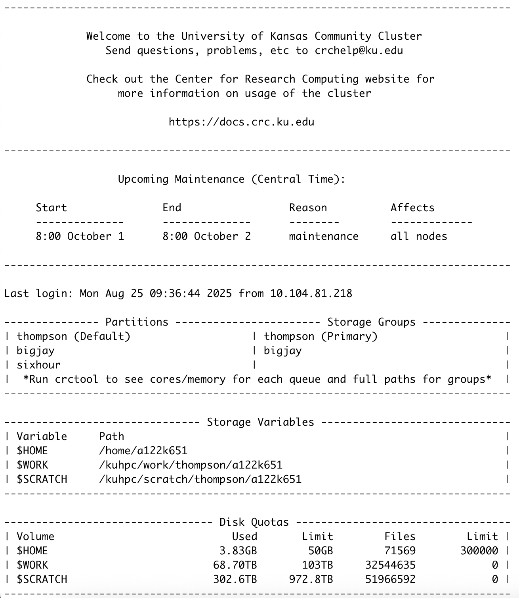

Joining the KU Community Cluster
=================================

.. note::

   This page is adapted from the group document, "Getting Access to the KU Community Cluster", written by Dr. Ashley Borkowski.

.. _Applying for a Cluster Profile:

Applying for a Cluster Profile
-----------------------------------------------------------------

Fill out the `application form`_ with the following:

* Your name, KU Username (i.e. *a123b456*)
* KU email (i.e. *a123b456@ku.edu*)
* Position = "Student"
* Department = "Chemistry"
* Cluster = "KU Community Cluster"
* Owner Group = "Thompson"
* Research Group or Project = "Thompson Group Graduate Student"
* Research Description = "I will be working in Ward Thompson's research group during my graduate studies and I am requesting access to his work and scratch directory" (or something similar in nature). 

.. note::

   This process may take 24-48 hours. You may receive emails during this time related to your request.

.. _application form: https://deptsec.ku.edu/~crc/forms/form/2

Once you have received confirmation for joining the cluster, open your Terminal window and type ``ssh -XY username@hpc.crc.ku.edu`` (where ``username`` is your same KU Username from above). The ``-XY`` allows for plotting in XMGrace, which may be used for future projects (make sure you have installed `XQuartz`_ before using XMGrace). 

.. _XQuartz: https://www.xquartz.org/

.. note::

	The KU Cluster has its own QuickStart Guide for new users to the cluster. To view this guide for more information on the cluster, see https://docs.crc.ku.edu/quick-start/.

You will be asked to enter your KU password. If you succesfully log on, you should see the following screen.

|

Some key details can be seen from this screen:

	i. Upcoming maintenance shows dates that the cluster is down. This happens routinely every ~90 days. Jobs that are running are cancelled and pending jobs are paused until maintenance is completed. 
	ii. Storage Variables denote the paths to your cluster profile. When accessing your own profile, simply type ``cd /home/KUID`` where ``KUID`` is your affiliated KU Username (*a123b456*). If you want to access another individual's directories, you can do so by the following prefix: ``cd /kuhpc/work/thompson/KUID`` or ``cd /kuhpc/scratch/thompson/KUID``, for either the work or scratch profiles respectively. When accessing other people's data, it is recommended you copy (``cp path/to/file path/to/destination``) to prevent any permanent changes to the original work. 
	iii. Disk Quotas shows how much storage has been used for each major directory. The ``$HOME`` directory is for your personal usage and is the most limited. The ``$SCRATCH`` directory is the largest, but is cleaned out every **120 days**. It is important to move **any** files that are pertinant to your work from your ``$SCRATCH`` directory to ensure they are not deleted. The ``$WORK`` directory is balanced by having both limited storage (but much larger than the ``$SCRATCH`` directory) but having files retain to your profile (so you need not worry about them being deleted). Another disk (not shown on the Disk Quotas section), known as the ``$TEMP`` disk, allows for a large amount of space but only **30 days** before being purged. Similarly to the ``$SCRATCH`` directory, files will need to be moved to another location to ensure they are retained. 

.. _Connecting to the Cluster off Campus with KUAnywhere:

Connecting to the Cluster off Campus with KUAnywhere
------------------------------------------------------

Connecting to the cluster from a non-KU wifi source can only be done with the use of KUAnywhere. The steps to download and use the KUAnywhere VPN are listed.

* Download the KUAnywhere Application from https://technology.ku.edu/catalog/ku-anywhere-vpn#top and scroll down to the Personal Computers seciton and select the `KU Software Web Store`_ link. 
* Login with your KUID and password and navigate the website until you find the "KU Anywhere" VPN. It is free for KU users and can be downloaded to your computer accordingly. 
* You will be able to activate a Cisco Secure Client account and use it to turn on the VPN for your computer. There are instructions which your computer will ask for permissons that you *must* complete in order to connect to the cluster remotely. 
* Steps to download and activate the Cisco client are given: https://kuit.service-now.com/kb?id=kb_article&sys_id=d1051ac66f9b5a00cccd53541c3ee4eb.

	- You will have to login with your KUID and use your "DUO Mobile" app to access the cluster remotely.

* If you have followed all the steps but are repeatedly warned of a "man in the middle attack", follow these instructions:

	- For Windows users:

		* If using PuTTY, click “Yes” to update PuTTY’s cache and store the new host key file.
		* If using MobaXterm, remove your known_hosts file.

	- For Mac users:

		* ``ssh-keygen -R hpc.crc.ku.edu``
		* ``rm ~/.ssh/known_hosts``

	- For Linux users:

		* Remove or edit your known_hosts file under ``~/.ssh/known_hosts``

* For questions, contatct KU Cluster Support at: crchelp@ku.edu.

.. _KU Software Web Store: https://kusoftware.ku.edu/local-login
