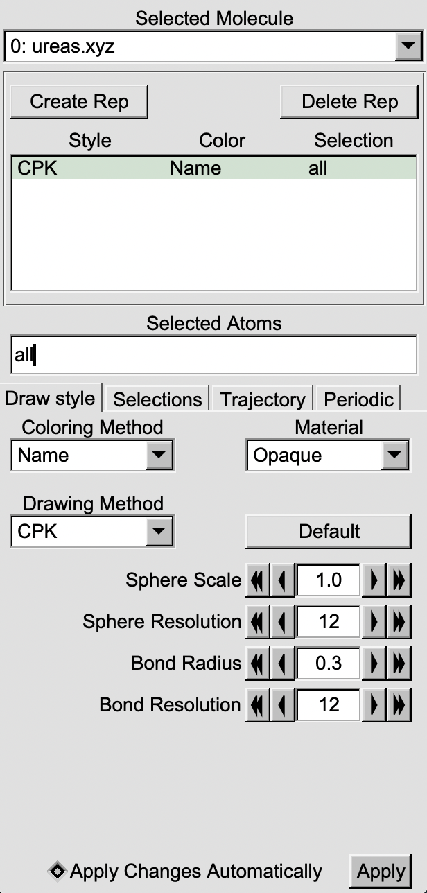

|ico0| VMD (Visual Molecular Dynamics)
##################################

.. |ico0| image:: molden_images/vmd0.png
   :height: 2.5ex
   :width: 2.5ex
   :target: https://www.ks.uiuc.edu/Research/vmd/

.. _here:  https://www.ks.uiuc.edu/Development/Download/download.cgi?PackageName=VMD

VMD is a tool (similar to :doc:`PyMOL`) to visualize trajectories from simulations. ``.xyz``, ``.gro``, among other types of files can be uploaded quickly to visualize a simulation. You can download VMD and previous versions _`here`. 

VMD Basics
===========

Once VMD is downloaded, the application can be opened. It will open a visualization screen, a configuration menu, and a terminal for importing and viewing the file of interest. To upload a molecule, select the "File" button on the configuration panel and press "New Molecule". The following screen will allow you to upload a molecule, which you can select or type the path accordingly.

.. important::
  Make sure to press the "Load all at once" button to load the simulation quickly. Otherwise, each frame will load individually and this may take a long time.

.. image:: molden_images/vmd1.png
  :height: 200px
  :align: right

